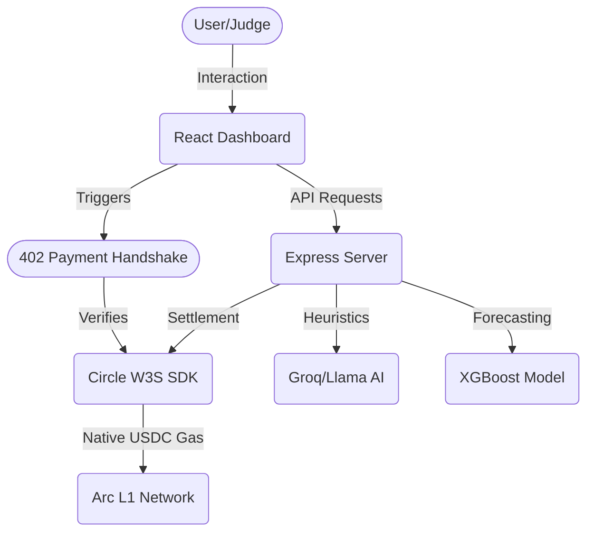

# 🛡️ Atlas Arc: Agentic Economy Dashboard
### *Real-Time USDC-Native Settlement on Arc L1*

**Atlas Arc** is a high-performance monitoring and execution dashboard designed for the **Arc L1 Network**. It showcases the future of the **Agentic Economy**, where AI agents can execute sub-cent transactions using USDC as native gas, eliminating the complexity of native token refueling and volatility.

---

## 🏛️ Problem: The "Gas Gap" in Agentic Commerce
Traditional L1 networks (Ethereum, Solana) require agents to hold a volatile native token (ETH/SOL) to pay for gas. This introduces:
1.  **Refueling Friction:** Agents stop working when they run out of native tokens.
2.  **Accounting Complexity:** Businesses must track exchange rates between USDC (their revenue) and the native gas token (their cost).
3.  **Margin Erosion:** High gas fees make sub-cent "nanopayments" between agents impossible.

## ⚡ The Atlas Arc Solution
By leveraging **Arc L1’s Native USDC Gas** and **Circle’s W3S Infrastructure**, Atlas Arc enables a purely dollar-denominated economy:
*   **Gas-Free for Operators:** All fees are settled in USDC at a fraction of a cent ($0.00001).
*   **HTTP 402 Handshake:** A first-of-its-kind "Pay-as-you-go" protocol for agentic data access.
*   **ML-Driven Surge Pricing:** Real-time demand forecasting using XGBoost to protect network margin.

---

## 🏢 Project Architecture



---

## 🚀 Key Features

### 📊 Network Efficiency Audit
Visualize the massive margin retention enabled by Arc L1. Our dashboard provides a real-time audit comparing Legacy L1 gas costs ($1.50+) vs. Arc’s native settlement ($0.00001).

### 🤝 HTTP 402 Payment Handshake
A live demonstration of the 402 handshake protocol. When an agent requests premium data, the system automatically triggers a USDC settlement flow, verifying payment on-chain before unlocking the resource.

### 🧠 Autonomous Agent Neural Map
Monitor a fleet of AI agents (Mythos, Scout, Brain, Executor) as they navigate the Arc network, settling tasks and coordinating via decentralized ledgers.

---

## 🛠️ Tech Stack
*   **Network:** Arc L1 (USDC-Native Gas)
*   **Settlement:** Circle Developer-Controlled Wallets (W3S)
*   **AI/ML:** Groq (Llama-3.3-70B) for heuristic analysis & anomaly detection.
*   **Frontend:** React + Tailwind + Framer Motion (Cyber-industrial Dark Theme).
*   **Backend:** Node.js + Express (402 Middleware Implementation).

---

## 📸 Screenshots

| Dashboard Overview | Network Audit | Handshake Demo |
| :---: | :---: | :---: |
|  |  |  |

*(Note: Replace with actual screenshots from your `dist/` or `assets/` folder)*

---

## ⚙️ Installation & Setup

1.  **Clone the Repository:**
    ```bash
    git clone [your-repo-link]
    cd atlas-arc-ml-dashboard
    ```

2.  **Install Dependencies:**
    ```bash
    npm install
    ```

3.  **Environment Configuration:**
    Create a `.env` file with your credentials:
    ```env
    CIRCLE_API_KEY=your_key
    CIRCLE_WALLET_ID=your_wallet
    CIRCLE_ENTITY_SECRET=your_secret
    GROQ_API_KEY=your_groq_key
    ```

4.  **Launch the System:**
    ```bash
    npx tsx server.ts
    ```

5.  **Access the Dashboard:**
    Open [http://localhost:3001](http://localhost:3001)

---

## 🏆 Hackathon Objective
This project demonstrates that an **Agentic Economy** is only viable when the cost of coordination is lower than the value of the task. Atlas Arc proves that Arc L1 + USDC is the ultimate stack for sub-cent, dollar-denominated agentic commerce.

---
*Built for the Arc L1 x Circle Hackathon 2024.*
